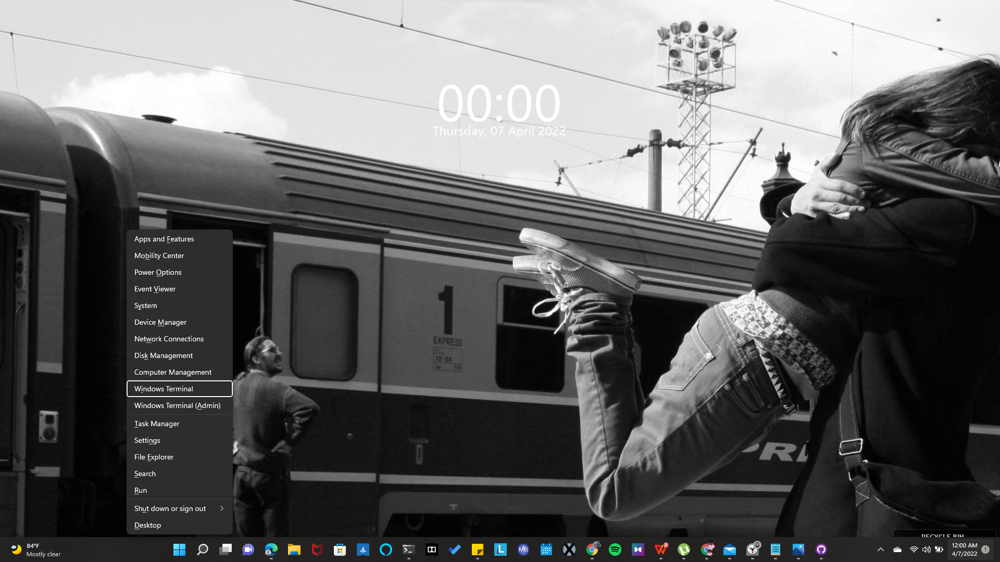
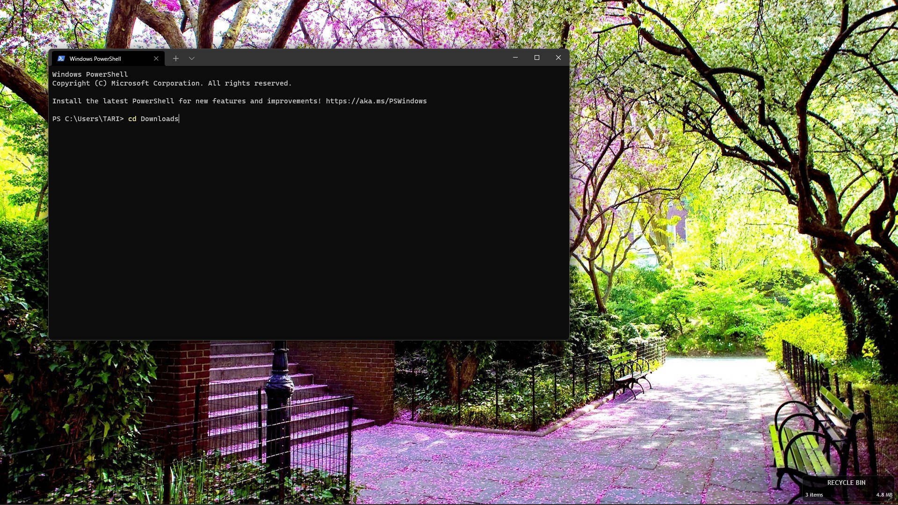
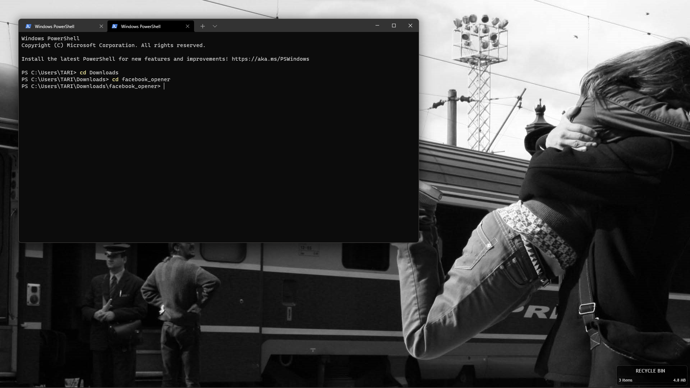
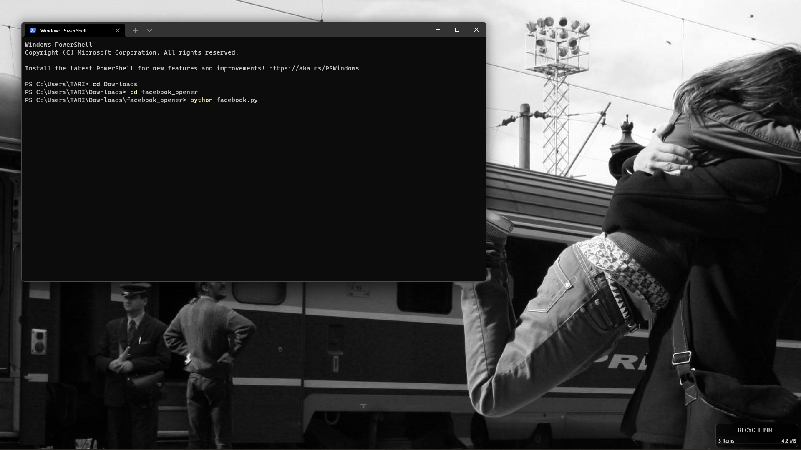

# Tired of opening Facebook like a normal person? Wanna Show your friends that you're tech savy? I gotcha. 😉
 Download this repository and follow the steps below to feel good while you use the command line in front of 
programming huggles
## Note: This program will only work if you have python installed on your system.
1. Press Win + X and select Windows terminal. 

2. Input "cd Downloads" and press enter

3. Input "cd facebook_opener" and press enter

4. Input "python facebook.py" and press enter

## There you have it . You just opened Facebook programmatically. Remember me when you get a job at Google 😂

